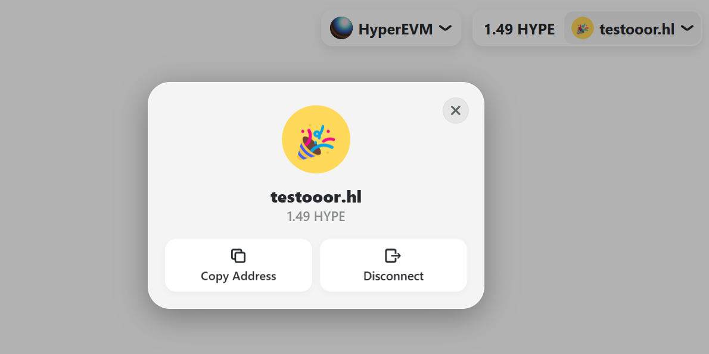

# Hyperliquid Names - RainbowKit

**The best way to connect a wallet 🌈 - Now with Hyperliquid Names support**

This repo is a fork of `@rainbow-me/rainbowkit@2.2.10` that includes support for `.hl` Primary Names and Avatars. Users will see their `.hl` name and Avatar in both the ConnectButton and AccountModal.

- See the changes at this [commit](https://github.com/rainbow-me/rainbowkit/compare/main...HLnames:rainbowkit:main)
- Learn more about [@rainbow-me/rainbowkit](https://github.com/rainbow-me/rainbowkit)
- Learn more about [Hyperliquid Names](https://hyperliquid-names.gitbook.io/hyperliquid-names)

## Quick start
There are two ways to consume `@hlnames/rainbowkit`

### If you're starting a new project without any dependencies
You can install `@hlnames/rainbowkit`:
```bash
npm install @hlnames/rainbowkit@latest
# or
pnpm add @hlnames/rainbowkit@latest
```

And use `@hlnames/rainbowkit` wherever you would have previously used `@rainbow-me/rainbowkit`:
```javascript
import { ConnectButton } from '@hlnames/rainbowkit';

export const YourApp = () => {
  return <ConnectButton />;
};
```

### If your project already uses `@rainbow-me/rainbowkit`
You can install our forked version of `@rainbow-me/rainbowkit@2.2.10`. With this option you won't need to change any of your imports.

```bash
npm install https://raw.githubusercontent.com/HLnames/rainbowkit/refs/heads/main/packages/rainbowkit/rainbow-me-rainbowkit-2.2.10.tgz
# or
pnpm add https://raw.githubusercontent.com/HLnames/rainbowkit/refs/heads/main/packages/rainbowkit/rainbow-me-rainbowkit-2.2.10.tgz
```

Use `@rainbow-me/rainbowkit` as you would normally.
```javascript
import { ConnectButton } from '@rainbow-me/rainbowkit';

export const YourApp = () => {
  return <ConnectButton />;
};
```

You can find the .tgz file here hosted here: https://github.com/HLnames/rainbowkit/tree/main/packages/rainbowkit

## Examples

You can find a example of `@hlnames/rainbowkit` in [/examples/with-next-app](./examples/with-next-app/).

Run the example with:
```bash
pnpm install
cd examples/with-next-app
pnpm run dev
```

## License

Licensed under the MIT License, Copyright © 2022-present [Rainbow](https://rainbow.me).

See [LICENSE](/LICENSE) for more information.
